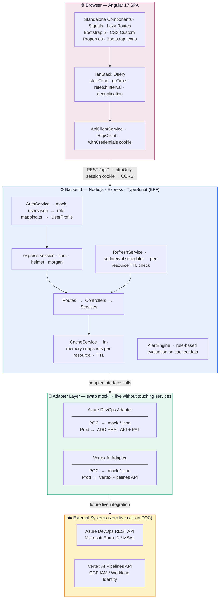

# DevOps Console — Internal Developer Portal

An enterprise-grade Internal Developer Portal (IDP) POC providing a unified operational dashboard for DevOps and MLOps teams.

---

## Table of Contents

1. [Project Overview](#1-project-overview)
2. [POC Scope](#2-poc-scope)
3. [Architecture Overview](#3-architecture-overview)
4. [Technology Choices](#4-technology-choices)
5. [Repository Structure](#5-repository-structure)
6. [Authentication & Authorization](#6-authentication--authorization)
7. [UI/UX Design](#7-uiux-design)
8. [Feature Walkthrough](#8-feature-walkthrough)
9. [Data Flow](#9-data-flow)
10. [Optimization Strategy](#10-optimization-strategy)
11. [Local Development](#11-local-development)
12. [Cloud Run Deployment](#12-cloud-run-deployment)
13. [API Overview](#13-api-overview)
14. [Future Roadmap](#14-future-roadmap)
15. [Tradeoffs & Design Decisions](#15-tradeoffs--design-decisions)
16. [Screens Reference](#16-screens-reference)

---

## 1. Project Overview

**What it is:** A web-based Internal Developer Portal that gives DevOps engineers, MLOps engineers, platform engineers, and admins a single pane of glass over:

- Azure DevOps agent pool health and availability
- Self-hosted build agent status
- Pipeline job queue and queue wait times
- Pipeline gate approval tracking
- Vertex AI / MLOps pipeline execution monitoring across multiple GCP projects
- Alert management for infrastructure degradation
- Centralized configuration management

**Who it is for:** Internal engineering teams operating Azure DevOps and GCP/Vertex AI workloads at enterprise scale.

**Why it exists:** At scale (50–100+ Azure DevOps projects, multiple GCP projects), there is no single view across all pools, agents, and ML pipelines. Engineers context-switch across Azure DevOps portals, GCP consoles, and individual project dashboards. This portal normalizes and aggregates all that data in one operational dashboard.

---

## 2. POC Scope

### Implemented

| Feature | Status |
|---|---|
| Login flow with mocked Entra ID users | ✅ |
| Role-based dynamic sidebar menu | ✅ |
| Dashboard with summary cards and pool health | ✅ |
| Agent Pools — grid and table views, health bar, filters | ✅ |
| Agents — status table, capability detail, pool filter | ✅ |
| Job Queue — time-range filter, job table | ✅ |
| Pending Approvals — age tracking, read-only | ✅ |
| Alerts — severity/status filters, acknowledge action | ✅ |
| Vertex AI Jobs — project/region/state filters, inline detail | ✅ |
| Configuration — editable thresholds, intervals, feature flags | ✅ |
| Light / dark theme toggle | ✅ |
| Backend BFF with mock adapters | ✅ |
| In-memory caching with TTL and refresh intervals | ✅ |
| Background polling scheduler | ✅ |
| Alert engine (rule-based) | ✅ |
| Config persistence to JSON file | ✅ |
| Docker Compose for local orchestration | ✅ |

### Mocked / Not Yet Live

| Item | What Replaces It in Production |
|---|---|
| Azure DevOps API calls | `mock-azure-devops.adapter.ts` → swap adapter for live REST calls |
| Vertex AI API calls | `mock-vertex-ai.adapter.ts` → swap adapter for Vertex Pipelines REST API |
| Microsoft Entra ID login | Hardcoded users in `mock-users.json` → MSAL OAuth2 flow |
| Redis cache/session | In-memory `Map` stores → Cloud Memorystore (Redis) with `ioredis` |
| Config persistence | JSON file → Firestore (single document) or Cloud Storage (JSON blob) |
| Approval actions | Read-only with placeholder buttons |
| Log / artifact links | Static labels (not linked to real GCS/Cloud Logging) |

---

## 3. Architecture Overview

```
┌──────────────────────────────────────────────────────────────┐
│  Browser — Angular SPA                                       │
│  Auth Guard → Role Guard → Lazy-loaded Feature Modules       │
│  TanStack Query (cache + refetch) → ApiClientService         │
└─────────────────────┬────────────────────────────────────────┘
                      │  REST /api/*  (cookie session, CORS)
┌─────────────────────▼────────────────────────────────────────┐
│  Backend — Node.js + Express + TypeScript (BFF)              │
│                                                              │
│  Routes → Controllers → Services → Adapters                  │
│                              ↓                               │
│  CacheService (in-memory snapshots per resource)             │
│  AlertEngine  (rule evaluation on snapshot data)             │
│  RefreshService (setInterval background polling)             │
│  ConfigService (JSON file persistence)                       │
│  AuthService  (mock users + role mapping)                    │
└──────────────────────────────────────────────────────────────┘
         ↓ adapter interfaces (future live integrations)
┌──────────────────────────────────────────────────────────────┐
│  External Systems (mocked in POC)                            │
│  Azure DevOps REST API    Vertex AI REST API                 │
│  Microsoft Entra ID       GCP IAM / Workload Identity        │
└──────────────────────────────────────────────────────────────┘
```

### Architecture & Tech Stack Diagram



### Key Design Decisions

**Backend-for-Frontend (BFF) pattern:** The Angular app never calls Azure DevOps or Vertex AI directly. All external calls are made by the backend, which normalizes the data into portal-friendly DTOs. This is critical for scale: a single backend can aggregate 70+ Azure DevOps projects without the browser making 70+ parallel requests.

**Adapter pattern:** Each external integration (`azure-devops.adapter.ts`, `vertex-ai.adapter.ts`) is a class implementing a standard interface. Swapping mock → live integration means changing only the adapter, not the service or controller.

**Cached snapshots:** The backend stores the last successful fetch of each resource in memory. API endpoints serve from cache by default, so page loads are fast even if the external system is slow or unreachable.

**Role-based menu:** The menu is generated server-side based on the authenticated user's roles. The frontend renders whatever the `/api/menu` endpoint returns — no role logic lives in the frontend templates.

---

## 4. Technology Choices

### Frontend: Angular 17

- **Why Angular:** Enterprise-grade framework with built-in dependency injection, strong typing, lazy loading, and long-term LTS support. Well-suited for internal portals with many views and role-based access.
- **Standalone components:** No NgModules. Every component declares its own imports, keeping code modular and tree-shakeable.
- **Signals:** Angular 17 signals (`signal`, `effect`, `input`, `output`) used throughout — no RxJS complexity in components where it's unnecessary.
- **No NgRx:** Signals + TanStack Query covers all state management needs without the NgRx boilerplate overhead.

### Bootstrap 5 + CSS Custom Properties

- **Why Bootstrap:** Provides a complete responsive grid and utility system without requiring a heavy Angular component library. Fine-grained control over styling with minimal JavaScript dependency.
- **CoreUI-style layout:** Sidebar + topbar shell built from scratch using Bootstrap and custom CSS — no dependency on CoreUI package itself. This avoids version coupling and reduces bundle size.
- **CSS custom properties for theming:** Light/dark mode is implemented via `data-theme` attribute on `<html>` and a set of CSS variables (`--dc-*`). No CSS duplication, no Angular Material theming overhead.

### TanStack Query

- **Why TanStack Query:** Server-state management with stale-while-revalidate caching, automatic background refetch, loading/error states, and request deduplication out of the box. Replaces manual `BehaviorSubject` + `tap` + loading flag patterns.
- **Query keys:** Every query is keyed by resource + filters. Filter changes update the query key automatically, triggering a new fetch without manual subscription management.

### Backend: Node.js + Express + TypeScript

- **Why not NestJS:** NestJS adds significant complexity and startup overhead for a POC. Express with TypeScript provides the same structure with less ceremony. Controllers, services, and adapters are plain TypeScript classes.
- **express-session:** Session-based auth (httpOnly cookie) avoids the frontend needing to manage tokens. Designed to be replaced with MSAL + Entra ID in production.

### Minimal Dependencies

A core goal is keeping the dependency footprint small for a private-proxy deployment environment:

| Package | Purpose |
|---|---|
| express | HTTP server |
| cors, helmet, morgan | Standard middleware |
| express-session | Session management |
| dotenv | Environment config |
| @angular/core + platform | Angular framework |
| @tanstack/angular-query-experimental | Server-state caching |
| bootstrap, bootstrap-icons | UI framework + icons |
| rxjs | Angular peer dependency only |

No charting library, no heavy component library, no state management framework.

---

## 5. Repository Structure

```
devops-console/
├── README.md
├── .gitignore
├── .env.example                  # Root env template
├── docker-compose.yml            # Local orchestration
│
├── .azure-pipelines/
│   ├── backend.yml               # CI/CD — triggers on backend/** changes
│   ├── frontend.yml              # CI/CD — triggers on frontend/** changes
│   └── terraform.yml             # Plan/Apply — triggers on terraform/** changes
│
├── terraform/
│   ├── versions.tf               # Provider google ~> 6.0, Terraform >= 1.9
│   ├── variables.tf              # project_id, region, env, images, secrets
│   ├── locals.tf                 # Name prefixes (respects GCP char limits)
│   ├── apis.tf                   # Enables required GCP APIs
│   ├── networking.tf             # VPC, subnet, VPC Access Connector
│   ├── artifact_registry.tf      # Docker image registry
│   ├── redis.tf                  # Cloud Memorystore BASIC 1 GB (sessions + cache)
│   ├── secrets.tf                # SESSION_SECRET in Secret Manager
│   ├── iam.tf                    # Backend service account + invoker bindings
│   ├── cloud_run.tf              # Backend + frontend Cloud Run services
│   ├── outputs.tf                # Frontend URL, backend URL, registry path
│   └── terraform.tfvars.example  # Copy to terraform.tfvars and fill in values
│
├── backend/
│   ├── .env.example
│   ├── package.json
│   ├── tsconfig.json
│   └── src/
│       ├── server.ts             # Entry point, graceful shutdown
│       ├── app.ts                # Express app, middleware, route registration
│       ├── adapters/
│       │   ├── azure-devops.adapter.ts  # Mock Azure DevOps integration
│       │   └── vertex-ai.adapter.ts     # Mock Vertex AI integration
│       ├── auth/
│       │   ├── auth.service.ts   # User lookup, profile building
│       │   └── role-mapping.ts   # Entra group → portal role mapping
│       ├── cache/
│       │   └── cache.service.ts  # In-memory snapshot store with TTL
│       ├── controllers/          # Request handlers (thin — delegate to services)
│       ├── data/                 # Static mock JSON fixtures
│       │   ├── mock-pools.json
│       │   ├── mock-agents.json
│       │   ├── mock-queue.json
│       │   ├── mock-approvals.json
│       │   ├── mock-vertex-jobs.json
│       │   ├── mock-users.json
│       │   └── default-config.json
│       ├── middleware/
│       │   ├── auth.middleware.ts  # requireAuth guard for protected routes
│       │   └── error.middleware.ts # 404 + error handler
│       ├── models/                 # TypeScript interfaces / DTOs
│       ├── routes/                 # Express route definitions
│       └── services/
│           ├── devops.service.ts   # Pool, agent, queue, approval logic
│           ├── mlops.service.ts    # Vertex job logic
│           ├── alert.service.ts    # Alert store, acknowledge, resolve
│           ├── config.service.ts   # Config load/save to JSON file
│           └── refresh.service.ts  # Background polling scheduler
│
└── frontend/
    ├── angular.json
    ├── package.json
    ├── proxy.conf.json             # Dev proxy: /api → localhost:3000
    ├── tsconfig.json
    └── src/
        ├── index.html
        ├── main.ts
        ├── styles.scss             # Global styles, Bootstrap overrides, themes
        ├── environments/
        └── app/
            ├── app.component.ts    # Root component — bootstraps auth
            ├── app.config.ts       # Angular providers + TanStack QueryClient
            ├── app.routes.ts       # Route definitions with lazy loading + guards
            ├── core/
            │   ├── auth/           # AuthService, authGuard, roleGuard
            │   ├── http/           # ApiClientService (typed HTTP wrapper)
            │   ├── menu/           # MenuService (signal-based menu state)
            │   └── theme/          # ThemeService (light/dark toggle)
            ├── layout/
            │   ├── layout.component.ts    # App shell (sidebar + header + outlet)
            │   ├── sidebar/               # Role-based nav menu
            │   └── header/                # Topbar with refresh, theme, user menu
            ├── models/                    # Shared TypeScript interfaces
            ├── shared/components/
            │   ├── stat-card/             # Summary metric card
            │   ├── status-badge/          # Color-coded status pill
            │   ├── page-header/           # Reusable page title + refresh button
            │   └── loading-spinner/       # Centered spinner with optional message
            └── features/
                ├── auth/login/            # Login page
                ├── dashboard/             # Home dashboard
                ├── devops/
                │   ├── pools/             # Agent pool grid/table
                │   ├── agents/            # Agent list with expandable detail
                │   ├── queue/             # Job queue with time-range filter
                │   ├── approvals/         # Pending approvals
                │   └── alerts/            # Alert list with acknowledge
                ├── mlops/
                │   └── vertex-jobs/       # Vertex AI job table + inline detail
                ├── config/                # Config editor
                └── about/                 # Architecture + roadmap
```

---

## 6. Authentication & Authorization

### Current POC Flow

```
User submits login form
    → POST /api/auth/login {username, password}
    → Backend: auth.service.ts looks up mock-users.json
    → Matches credentials → calls role-mapping.ts
    → Returns UserProfile {id, displayName, email, groups, roles}
    → Session stored server-side (express-session, in-memory store)
    → Cookie set: connect.sid (httpOnly)

Subsequent requests
    → Cookie sent automatically
    → auth.middleware.ts validates session presence
    → Attaches req.session.user to request

Frontend
    → AppComponent.ngOnInit() calls GET /api/auth/me
    → Sets authService.currentUser signal
    → Login page calls GET /api/menu → MenuService.menuItems signal updated
    → Role guards protect routes using currentUser().roles
```

### Mock Users

| Username | Password | Roles |
|---|---|---|
| admin | admin123 | portal.admin (all access) |
| devops | devops123 | devops.read, devops.approval.read |
| mlops | mlops123 | mlops.read |
| readonly | readonly123 | devops.read, mlops.read |

### Entra Group → Role Mapping

```typescript
// backend/src/auth/role-mapping.ts
const GROUP_ROLE_MAP = {
  'entra-portal-admin':    'portal.admin',
  'entra-devops-read':     'devops.read',
  'entra-devops-approver': 'devops.approval.read',
  'entra-mlops-read':      'mlops.read',
  'entra-config-admin':    'config.admin',
};
```

### Production Entra ID Migration Path

1. Register an Azure AD App Registration with the appropriate API permissions
2. Configure redirect URI for MSAL popup/redirect flow
3. On login, redirect to Entra ID → receive ID token
4. Backend validates the JWT, extracts `groups` claim
5. Feed groups through existing `resolveRoles()` — **zero frontend changes required**
6. Replace `express-session` in-memory store with Redis-backed store
7. Add PKCE flow and token refresh handling in `auth.service.ts`

The frontend `AuthService` only calls `/api/auth/me` — it does not care how the session was established.

---

## 7. UI/UX Design

### Color System

| Token | Value | Usage |
|---|---|---|
| `--dc-primary` | `#8e2157` | Buttons, active nav, accent color |
| `--dc-primary-dark` | `#6b1842` | Button hover |
| `--dc-primary-subtle` | `#f5e6ee` | Icon backgrounds, badges |
| `--dc-page-bg` | `#f4f6fb` (light) / `#0f1117` (dark) | Page background |
| `--dc-card-bg` | `#ffffff` (light) / `#1a1d2e` (dark) | Card backgrounds |
| `--dc-sidebar-bg` | `#8e2157` | Sidebar (always dark) |

### Theming

- Default: **light mode**
- Dark mode toggled via `ThemeService` which sets `data-theme="dark"` on `<html>`
- All colors are CSS custom properties — no duplication between themes
- Theme preference persisted in `localStorage`

### Reusable Components

| Component | Selector | Purpose |
|---|---|---|
| `StatCardComponent` | `app-stat-card` | Metric card with icon, value, subtext |
| `StatusBadgeComponent` | `app-status-badge` | Color-coded status pill with dot |
| `PageHeaderComponent` | `app-page-header` | Page title, subtitle, optional refresh button |
| `LoadingSpinnerComponent` | `app-loading-spinner` | Centered spinner with message |

### Menu Generation

The sidebar menu is generated from `/api/menu` which builds the menu server-side based on `req.session.user.roles`. Menu items with `requiredRoles` are only included if the user has at least one matching role. The frontend renders the returned menu array with no role logic — the server is the authority.

---

## 8. Feature Walkthrough

### Dashboard

Home page showing 8 summary stat cards (pools, agents, offline agents, critical alerts, queued jobs, pending approvals, Vertex running, Vertex failed), a pool health breakdown bar, a system status widget, and quick-link cards to the main modules.

### Agent Pools (`/devops/pools`)

Grid and table view toggle. Each pool card shows: name, organization, health availability bar (color-coded: green ≥70%, amber 50–70%, red <50%), agent counts (total/online/busy/offline), status badge, and a link to filtered agents view. Filters: name search, health state. Auto-refreshes every 60s via TanStack Query `refetchInterval`.

### Agents (`/devops/agents`)

Table showing all agents across all pools. Columns: name, pool, status badge, enabled flag, OS, version, tags (first 3 shown). Expandable row reveals full capability map and all tags. Filters: name search, status, pool. Rows highlighted in light red for enabled-but-offline agents.

### Job Queue (`/devops/queue`)

Default view: last 6 hours. Date-range selector adjusts `sinceHours` query parameter. Summary stats at top: queued count, running count, average queue time, oldest job. Table: job ID, pipeline name, project, pool, requested by, requested at, queue duration, status, approval required flag.

### Pending Approvals (`/devops/approvals`)

List of pipeline gate approvals waiting for human review. Columns: approval ID, project, pipeline, stage/environment, approvers, waiting since, age (highlighted red if >threshold). Placeholder approve/reject buttons are rendered but disabled with a "Not enabled in POC" tooltip (controlled by `featureFlags.enableApprovalActions`).

### Alerts (`/devops/alerts`)

Active alerts generated by the backend alert engine. Rules:
- Agent offline > N minutes
- Pool availability < critical threshold
- Queue job wait > N minutes
- Pending approval age > N hours

Alerts are sorted by status (open first) then severity (critical first). Each alert has an acknowledge button. Expanded view shows metadata, timestamps, and source ID.

### Vertex AI Jobs (`/mlops/vertex-jobs`)

Table of pipeline job executions across configured GCP projects. Summary row: running, succeeded, failed counts, average duration. Filters: search, project, region, state. Inline detail panel (click info button): job metadata, labels, state history, resource links (placeholder in POC).

### Configuration (`/config`)

Tabular/form editor for:
- Azure DevOps org enable/disable toggles
- GCP project enable/disable toggles
- Alert thresholds (editable number inputs)
- Refresh intervals (with human-readable rendering)
- Feature flags (toggle switches)
- Display settings (theme, page size, timezone)

Changes saved via `PUT /api/config` to the JSON file store. Reset button restores defaults.

---

## 9. Data Flow

```
1. User visits the app
   └── AppComponent.ngOnInit() → GET /api/auth/me
       ├── Session exists → authService.currentUser set, isAuthenticated = true
       └── No session → isAuthenticated = false

2. Auth guard checks isAuthenticated
   ├── true  → render layout shell
   └── false → redirect to /login

3. Login form submission
   └── POST /api/auth/login
       └── Backend authenticates → sets session → returns UserProfile
           └── Frontend: authService.currentUser set
               └── GET /api/menu → menuService.menuItems set
                   └── router.navigate('/dashboard')

4. Dashboard loads
   └── DashboardComponent creates TanStack Query
       queryKey: ['dashboard', 'summary']
       queryFn: GET /api/dashboard/summary
       └── Backend: reads from CacheService snapshot
           └── Returns aggregated DashboardSummary DTO

5. Pools page loads
   └── PoolsComponent creates TanStack Query
       queryKey: ['devops', 'pools']
       queryFn: GET /api/devops/pools
       └── Backend: devopsService.getPools()
           ├── CacheService has fresh data → return cached snapshot
           └── Cache expired → devops adapter fetches from mock JSON → store in cache

6. Background refresh (server-side)
   └── RefreshService.startBackgroundRefresh()
       ├── Every 60s: refresh pools + agents snapshot
       ├── Every 90s: refresh queue + approvals
       ├── Every 120s: refresh vertex jobs
       ├── After each refresh: run AlertEngine rule evaluation
       └── Any alert state changes → update in-memory alert store

7. Manual refresh (frontend)
   └── User clicks Refresh button → POST /api/system/refresh
       └── Backend triggers immediate refresh of all resources
           └── TanStack Query refetch() on component re-fetches updated data
```

---

## 10. Optimization Strategy

### The Scale Problem

At 70 Azure DevOps projects, naively polling all projects from the browser would generate:
- 70× `/pools` requests per page load
- 70× agent requests
- 70× queue requests

Total: **200+ HTTP requests per page load**, each with OAuth overhead.

### Solution Architecture

**1. Backend Aggregation**

The frontend makes exactly 1 request per resource type (e.g., `GET /api/devops/pools`). The backend aggregates across all configured projects before responding. The browser never knows how many upstream projects exist.

**2. Cached Snapshots**

```typescript
// CacheService stores snapshots per resource key
cache.set('pools', normalizedPoolData, ttlMs);
// On API request: return cache if fresh, else fetch + store
```

Snapshot TTLs are configurable per resource. Typical values:
- Pools: 60s
- Agents: 60s
- Queue: 30s
- Vertex jobs: 120s
- Approvals: 60s

**3. Background Refresh (Server-side)**

`RefreshService` runs `setInterval` loops on the backend. Snapshots are pre-warmed before any user requests them. Page load always hits warm cache.

**4. Angular Lazy Loading**

Feature modules are lazy-loaded via `loadComponent()` in route definitions. Only the bundle for the active route is downloaded. Dashboard does not load DevOps or MLOps code.

**5. TanStack Query Caching**

- `staleTime: 30_000` — data served from cache for 30s before background refetch
- `gcTime: 300_000` — cache retained 5 minutes after component unmount
- `refetchInterval: 60_000` — polling while component is mounted
- `refetchOnWindowFocus: false` — no surprise refetches on tab focus

**6. Query Key Design**

Filter changes (project, region, state) update the query key, which triggers a new fetch with the correct parameters. No manual subscription management.

**7. Future: Pagination + Streaming**

For very large datasets, the backend API supports a `pageSize` parameter. In production, the backend would use streaming aggregation with Azure DevOps continuation tokens.

---

## 11. Local Development

### Prerequisites

- Node.js 18+
- npm 9+

### One-command start (recommended)

Install deps once, then use a single command from the repo root:

```bash
# First-time install
npm run install:all

# Copy env files (only needed once)
cp backend/.env.example backend/.env

# Start both backend and frontend in parallel
npm start
# Backend:  http://localhost:3000
# Frontend: http://localhost:4200
```

**Add a shell alias** so you can launch the portal from anywhere:

```bash
# Add to ~/.zshrc or ~/.bashrc
echo "alias devops-console='npm --prefix ~/Documents/projects/devops-console start'" >> ~/.zshrc && source ~/.zshrc

# Then from any directory:
devops-console
```

### Install

```bash
# All at once from repo root
npm run install:all

# Or individually
cd backend  && npm install
cd frontend && npm install
```

### Environment Setup

```bash
cp backend/.env.example backend/.env
# Defaults work for local POC — no edits needed
```

### Run Backend only

```bash
cd backend
npm run dev
# API available at http://localhost:3000
# Health check: curl http://localhost:3000/api/system/health
```

### Run Frontend only

```bash
cd frontend
npm start
# App available at http://localhost:4200
# Proxies /api/* to http://localhost:3000 via proxy.conf.json
```

### Run with Docker Compose

```bash
docker-compose up --build
# Frontend: http://localhost:4200
# Backend:  http://localhost:3000
```

### Demo Accounts

| Username | Password | Access Level |
|---|---|---|
| `admin` | `admin123` | Full access — all modules |
| `devops` | `devops123` | DevOps module only |
| `mlops` | `mlops123` | MLOps module only |
| `readonly` | `readonly123` | DevOps + MLOps, read-only |

### Environment Variables

**Backend (`backend/.env`)**

```env
PORT=3000
NODE_ENV=development
SESSION_SECRET=your-secret-here
ALLOWED_ORIGINS=http://localhost:4200
```

**Frontend (`frontend/src/environments/environment.ts`)**

```typescript
export const environment = {
  production: false,
  apiBase: '/api',
};
```

---

## 12. Cloud Run Deployment

The app runs as two Cloud Run services (frontend + backend) backed by Cloud Memorystore Redis. All infrastructure is managed by Terraform.

### Infrastructure Overview

```
Artifact Registry          — stores backend and frontend Docker images
Cloud Run — backend        — Node.js/Express API, VPC-connected to Redis
Cloud Run — frontend       — nginx serving the pre-built Angular SPA,
                             proxies /api/* to the backend service
Cloud Memorystore (Redis)  — sessions + in-memory cache (replaces in-memory store)
VPC + VPC Access Connector — private network route from Cloud Run to Redis
Secret Manager             — SESSION_SECRET (never stored in plain env vars)
```

### Prerequisites

- [Terraform](https://developer.hashicorp.com/terraform/install) >= 1.9
- [gcloud CLI](https://cloud.google.com/sdk/docs/install) authenticated (`gcloud auth application-default login`)
- Docker (for building images)
- A GCP project with billing enabled

### Step 1 — Build and push images

```bash
# Authenticate Docker to Artifact Registry
gcloud auth configure-docker REGION-docker.pkg.dev

# Build images
docker build -t REGION-docker.pkg.dev/PROJECT_ID/devops-console/backend:latest  ./backend
docker build -t REGION-docker.pkg.dev/PROJECT_ID/devops-console/frontend:latest ./frontend

# Push (Artifact Registry must exist first — created by terraform apply in step 3)
# Run terraform apply once before pushing, or create the repo manually:
# gcloud artifacts repositories create devops-console --repository-format=docker --location=REGION
docker push REGION-docker.pkg.dev/PROJECT_ID/devops-console/backend:latest
docker push REGION-docker.pkg.dev/PROJECT_ID/devops-console/frontend:latest
```

### Step 2 — Configure Terraform

```bash
cd terraform
cp terraform.tfvars.example terraform.tfvars
```

Edit `terraform.tfvars`:

```hcl
project_id = "your-gcp-project-id"
region     = "us-central1"
env        = "dev"

backend_image  = "us-central1-docker.pkg.dev/your-gcp-project-id/devops-console/backend:latest"
frontend_image = "us-central1-docker.pkg.dev/your-gcp-project-id/devops-console/frontend:latest"

# Generate with: openssl rand -base64 32
session_secret = "your-32-plus-char-random-secret"

# Leave empty on first apply (see Step 4)
allowed_origins = ""
```

### Step 3 — First apply

```bash
cd terraform
terraform init
terraform apply
```

This creates all infrastructure. Note the outputs:

```
frontend_url          = "https://devops-console-dev-ui-xxxx.run.app"
backend_url           = "https://devops-console-dev-api-xxxx.run.app"
artifact_registry_url = "us-central1-docker.pkg.dev/your-project/devops-console"
redis_host            = "10.x.x.x"
```

### Step 4 — Fix CORS (second apply)

The backend's `ALLOWED_ORIGINS` cannot be set until the frontend URL is known. After the first apply, copy `frontend_url` from the outputs and re-apply:

```bash
# In terraform.tfvars, set:
allowed_origins = "https://devops-console-dev-ui-xxxx.run.app"

terraform apply   # Only the backend Cloud Run service is updated
```

The app is now fully deployed.

### Resources created

| Resource | Name pattern | Purpose |
|---|---|---|
| VPC | `devops-console-{env}-vpc` | Private network for Redis |
| VPC Access Connector | `dc-{env}-conn` | Cloud Run → Redis route |
| Artifact Registry | `devops-console` | Docker image storage |
| Cloud Memorystore | `devops-console-{env}-redis` | Sessions + cache |
| Secret Manager secret | `devops-console-{env}-session-secret` | `SESSION_SECRET` |
| Service account | `dc-{env}-backend` | Backend Cloud Run identity |
| Cloud Run service | `devops-console-{env}-api` | Backend |
| Cloud Run service | `devops-console-{env}-ui` | Frontend |

### Tearing down

```bash
cd terraform
terraform destroy
```

### CI/CD via Azure DevOps Pipelines

Each component has a dedicated pipeline in `.azure-pipelines/` that triggers only when its folder changes:

| Pipeline | Trigger path | CI | CD |
|---|---|---|---|
| `backend.yml` | `backend/**` | lint, tsc build | docker build+push, `gcloud run deploy` |
| `frontend.yml` | `frontend/**` | lint, ng build:prod | docker build+push, `gcloud run deploy` |
| `terraform.yml` | `terraform/**` | init, validate, plan | apply (requires environment approval) |

See `.azure-pipelines/` for setup instructions including required variable groups.

### Production hardening (beyond POC)

- Replace `allUsers` invoker binding on the backend with the frontend service account only, and set `ingress = INGRESS_TRAFFIC_INTERNAL_ONLY` on the backend
- Enable Cloud IAP on the frontend for org-only access
- Wire `REDIS_HOST` / `REDIS_PORT` into `express-session` using `connect-redis` + `ioredis`
- Replace JSON file config store with Firestore (single document) or Cloud Storage
- Add a Cloud Build or GitHub Actions pipeline to automate image builds on push

---

## 13. API Overview

All endpoints are prefixed with `/api/`.

### Auth

| Method | Path | Description |
|---|---|---|
| POST | `/auth/login` | Login with username/password |
| POST | `/auth/logout` | Destroy session |
| GET | `/auth/me` | Get current user profile |

**POST /auth/login request:**
```json
{ "username": "admin", "password": "admin123" }
```
**POST /auth/login response:**
```json
{
  "success": true,
  "user": {
    "id": "usr-001",
    "displayName": "Admin User",
    "email": "admin@internal.example.com",
    "groups": ["entra-portal-admin"],
    "roles": ["portal.admin"],
    "avatarInitials": "AU"
  }
}
```

### Menu

| Method | Path | Description |
|---|---|---|
| GET | `/menu` | Get role-filtered sidebar menu |

### Dashboard

| Method | Path | Description |
|---|---|---|
| GET | `/dashboard/summary` | Aggregated summary stats for home dashboard |

### DevOps

| Method | Path | Description |
|---|---|---|
| GET | `/devops/pools` | All pool summaries |
| GET | `/devops/pools/:id` | Single pool |
| GET | `/devops/pools/:id/agents` | Agents for a specific pool |
| GET | `/devops/agents` | All agents (optional `?poolId=`) |
| GET | `/devops/queue` | Queue jobs (`?sinceHours=6&project=&pool=`) |
| GET | `/devops/approvals` | Pending approvals (`?project=`) |
| GET | `/devops/alerts` | Alerts (`?status=open|acknowledged|resolved`) |
| POST | `/devops/alerts/:id/acknowledge` | Acknowledge an alert |

**GET /devops/pools response:**
```json
{
  "data": [
    {
      "id": "pool-001",
      "name": "Production Linux Agents",
      "organization": "my-org",
      "totalAgents": 10,
      "onlineAgents": 9,
      "offlineAgents": 1,
      "busyAgents": 4,
      "idleAgents": 5,
      "healthPercent": 90,
      "alertState": "healthy",
      "lastRefresh": "2026-03-28T10:00:00.000Z"
    }
  ],
  "total": 4
}
```

### MLOps

| Method | Path | Description |
|---|---|---|
| GET | `/mlops/vertex/jobs` | Vertex AI jobs (`?projectId=&region=&state=&search=`) |
| GET | `/mlops/vertex/jobs/:id` | Job detail with state history |

### Config

| Method | Path | Description |
|---|---|---|
| GET | `/config` | Load system configuration |
| PUT | `/config` | Save configuration changes |
| POST | `/config/reset` | Reset to defaults |

### System

| Method | Path | Description |
|---|---|---|
| GET | `/system/health` | Health check |
| GET | `/system/refresh-status` | Last refresh times per resource |
| POST | `/system/refresh` | Trigger immediate refresh |

---

## 14. Future Roadmap

### High Priority

**Real Microsoft Entra ID SSO**
- Register Azure AD app, configure MSAL popup/redirect
- Backend validates JWT, extracts security groups from `groups` claim
- Map groups through existing `resolveRoles()` — no frontend changes

**Live Azure DevOps Integration**
- Replace `mock-azure-devops.adapter.ts` with a real adapter using Azure DevOps REST API
- Authentication: PAT or Azure AD service principal with OAuth2 client credentials
- The adapter interface does not change; only the implementation changes

**Live Vertex AI Integration**
- Replace `mock-vertex-ai.adapter.ts` with calls to Vertex AI Pipelines REST API
- Authentication: GCP Workload Identity or service account JSON key
- Same adapter interface

### Medium Priority

- **Approval Actions** — Implement approve/reject via Azure DevOps Approvals API (already behind `featureFlags.enableApprovalActions`)
- **Redis Cache + Session Store** — Replace `Map`-based cache and in-memory session with Cloud Memorystore (Redis) using `connect-redis` + `ioredis`. Infrastructure already provisioned by Terraform — only application wiring remains.
- **Firestore / GCS Config Store** — Replace JSON file persistence with Firestore (single document) or a Cloud Storage JSON blob. No SQL database required — this app owns no relational data.
- **Alert Subscriptions** — Push alerts to Slack/Teams/PagerDuty via webhook
- **Pagination** — Add cursor/page-based pagination to queue and jobs endpoints for large result sets

### Low Priority

- **Kubernetes Workloads Module** — Cluster/pod/deployment health dashboard
- **Terraform Plans Module** — Show pending/applied Terraform changes
- **Cost Dashboard** — Azure + GCP spend aggregation
- **Audit Log** — Track config changes and approval actions with user attribution
- **Notification Center** — In-portal notification bell for critical alerts

---

## 15. Migrating from Mock to Live APIs

The POC uses static JSON fixtures and hardcoded users. Every integration point is isolated to a single file — no frontend changes are needed for any of these migrations.

### Step 1 — Authentication (Entra ID)

**File to change:** `backend/src/auth/auth.service.ts` + `backend/src/data/mock-users.json`

1. Register an Azure AD application in your tenant (Entra ID → App registrations).
2. Add redirect URI: `https://<your-frontend-url>/auth/callback`.
3. In your app registration, expose an API scope and add a `groups` claim under **Token configuration**.
4. Install MSAL: `npm install @azure/msal-node` (backend) and `@azure/msal-browser` (frontend).
5. Replace the `mock-users.json` lookup in `AuthService.validateUser()` with MSAL token validation.
6. Map the `groups` claim through the existing `resolveRoles()` function — this function does **not** change.
7. Set the following environment variables (or Secret Manager entries):
   ```
   ENTRA_TENANT_ID=<tenant-id>
   ENTRA_CLIENT_ID=<client-id>
   ENTRA_CLIENT_SECRET=<client-secret>
   ```

### Step 2 — Azure DevOps Integration

**File to change:** `backend/src/adapters/azure-devops.adapter.ts`

The adapter already implements a typed interface consumed by `DevopsService`. Replace the mock JSON reads with real HTTP calls — the service and controller layers are untouched.

```typescript
// Before (POC)
import pools from '../data/mock-pools.json';
return pools;

// After (production)
const response = await fetch(
  `https://dev.azure.com/${org}/_apis/distributedtask/pools?api-version=7.1`,
  { headers: { Authorization: `Basic ${btoa(':' + PAT)}` } }
);
return response.json();
```

Set these environment variables:
```
ADO_ORG=<your-org>
ADO_PAT=<personal-access-token>   # or use service principal OAuth2
```

The PAT requires these scopes: `Agent Pools (Read)`, `Build (Read)`, `Release (Read & execute)`, `Environment (Read & manage)`.

### Step 3 — Vertex AI Integration

**File to change:** `backend/src/adapters/vertex-ai.adapter.ts`

Same pattern as Azure DevOps — replace mock JSON reads with Vertex Pipelines REST API calls.

```typescript
// After (production)
const { GoogleAuth } = require('google-auth-library');
const auth = new GoogleAuth({ scopes: 'https://www.googleapis.com/auth/cloud-platform' });
const client = await auth.getClient();
const url = `https://${region}-aiplatform.googleapis.com/v1/projects/${project}/locations/${region}/pipelineJobs`;
const res = await client.request({ url });
return res.data.pipelineJobs;
```

Set these environment variables:
```
GCP_PROJECT_ID=<project-id>
GCP_REGION=<region>               # e.g. us-central1
```

Authentication on Cloud Run uses Workload Identity automatically — no key file needed.

### Step 4 — Session Store (Redis)

**File to change:** `backend/src/app.ts`

Redis infrastructure is already provisioned by Terraform (`terraform/redis.tf`). Only application wiring remains:

```bash
npm install connect-redis ioredis
```

```typescript
// Replace MemoryStore with RedisStore
import { createClient } from 'redis';
import RedisStore from 'connect-redis';
const redisClient = createClient({ url: process.env.REDIS_URL });
app.use(session({ store: new RedisStore({ client: redisClient }), ... }));
```

Set: `REDIS_URL=redis://<memorystore-ip>:6379`

### Step 5 — Config Persistence (Firestore or GCS)

**File to change:** `backend/src/services/config.service.ts`

Replace the JSON file read/write with a Firestore document or GCS blob. The service interface does not change — only the storage backend.

### Migration Checklist

| Item | File | Effort |
|---|---|---|
| Entra ID auth | `auth.service.ts` + `mock-users.json` | M |
| Azure DevOps adapter | `azure-devops.adapter.ts` | M |
| Vertex AI adapter | `vertex-ai.adapter.ts` | M |
| Redis session store | `app.ts` | S |
| Config persistence | `config.service.ts` | S |
| Approval actions | `approvals.controller.ts` | M |
| Alert webhooks | new `webhook.service.ts` | L |

> Effort: S = < 1 day, M = 1–3 days, L = 3+ days

---

## 16. Teams Notifications

The alert engine can post Adaptive Card messages to a Microsoft Teams channel whenever an alert fires, escalates, or resolves. Everything is configured through the app's **Config** page — no redeploy required.

### How It Works

```
Alert engine (every 30 s)
  └─ upsertAlert()  ──► fireNotification()  ──► sendTeamsAlert()  ──► Teams Incoming Webhook
        new alert                                Adaptive Card              Teams channel
        severity escalation
        resolved (optional)
```

Notifications are **fire-and-forget**: a webhook delivery failure is logged but never blocks the alert polling cycle.

### Step 1 — Create the Incoming Webhook in Teams

1. Open the Teams channel you want to receive alerts.
2. Click **···** (More options) → **Manage channel** → **Connectors**.
3. Find **Incoming Webhook** → **Add** → **Add** again → give it a name (e.g. `DevOps Console Alerts`) → optionally upload an icon → **Create**.
4. Copy the generated webhook URL — it looks like:
   ```
   https://contoso.webhook.office.com/webhookb2/xxxxxxxx-xxxx-xxxx-xxxx-xxxxxxxxxxxx@.../IncomingWebhook/...
   ```
5. Click **Done**.

> **Note:** In newer Teams tenants the Connectors UI has moved to **Settings → Apps → Manage your apps → Incoming Webhook**. If you can't find Connectors, search for "Incoming Webhook" in the Teams app store and add it to the channel.

### Step 2 — Configure in the App

1. Navigate to **Config** (sidebar → ⚙ Configuration).
2. Scroll to the **Teams Notifications** card.
3. Paste the webhook URL into the **Incoming Webhook URL** field.
4. Choose your settings:

| Setting | Description | Default |
|---|---|---|
| **Enabled** | Master on/off toggle | Off |
| **Minimum Severity** | `Info and above` / `Warning and above` / `Critical only` | Warning |
| **New alert** | Notify when an alert fires for the first time | On |
| **Escalation** | Notify when an alert goes from warning → critical | On |
| **Resolved** | Notify when an alert clears | Off |

5. Click **Send Test Message** to verify delivery before saving.
6. Toggle **Enabled** to on and click **Save Changes**.

### What a Notification Looks Like

Each message is an **Adaptive Card** with colour-coded severity:

| Severity | Colour | Emoji |
|---|---|---|
| Critical | 🔴 Red | 🔴 |
| Warning | 🟡 Yellow | 🟡 |
| Info | 🔵 Blue | 🔵 |
| Resolved | ✅ Green | ✅ |

The card includes the alert type, source, message, timestamp, and any relevant context (e.g. pool health %, offline duration, queue wait time).

### Fallback — Environment Variable

If you prefer not to store the webhook URL in the config JSON (e.g. for secrets management), set it as an environment variable. The app uses this as a fallback when `teamsNotifications.webhookUrl` in the config is empty:

```env
TEAMS_WEBHOOK_URL=https://contoso.webhook.office.com/webhookb2/...
```

The `enabled`, `minSeverity`, and event toggles in the Config page still apply even when using the env var.

### Changing the Channel

To route alerts to a different channel (e.g. a separate channel for critical-only):

1. Create a second Incoming Webhook in the new channel.
2. Go to Config → paste the new URL → Save.

Multi-channel routing (e.g. critical → ops channel, warning → dev channel) is not yet implemented but can be added by extending `TeamsNotificationsConfig` with an array of webhook targets.

---

## 17. Tradeoffs & Design Decisions

### POC Simplifications

| Decision | POC Choice | Production Alternative |
|---|---|---|
| Session store | express-session in-memory | Cloud Memorystore (Redis) with `connect-redis` |
| Config persistence | JSON file | Firestore (1 document) or Cloud Storage (JSON blob) — no SQL DB needed |
| Cache | In-memory `Map` | Cloud Memorystore (Redis) — same instance as session store |
| Adapter | Static mock JSON | Live REST API with retry/backoff |
| Auth | Hardcoded users | MSAL + Entra ID |
| Background jobs | `setInterval` | Bull queue / Cloud Scheduler |

### Why No NgRx

NgRx adds significant boilerplate (actions, reducers, effects, selectors) that is unnecessary when:
- Server state is owned by TanStack Query
- UI state is local to components (Angular signals handle this cleanly)
- There is no complex client-side state machine

The only shared state is the auth user and menu — both handled with `signal()` in `AuthService` and `MenuService`.

### Why Inline Templates (No Separate HTML Files)

Angular standalone components with inline templates keep each component self-contained in a single file. For a POC where all components are small to medium-sized, this reduces file count and makes code easier to navigate. Larger components (e.g., `config.component.ts`) could benefit from extraction in production.

### Why Bootstrap Over Angular Material

- Bootstrap has zero Angular coupling — it works with any framework version
- Bootstrap 5 removed jQuery dependency
- CSS custom properties make theming straightforward without a complex Material theming pipeline
- Smaller impact on bundle size when tree-shaken with sass imports

### Package Minimization

The project avoids packages that require network access to external CDNs or have complex native build dependencies. This is intentional for deployment behind a corporate proxy. All icons use Bootstrap Icons (bundled CSS font — no external CDN).

---

## 18. Screens Reference

| Route | Screen |
|---|---|
| `/login` | Login form with demo accounts hint |
| `/dashboard` | Summary cards, pool health bar, system status, quick links |
| `/devops/pools` | Pool grid/table with health bars and agent counts |
| `/devops/agents` | Agent table with expandable capability detail |
| `/devops/queue` | Job queue with time-range filter and status badges |
| `/devops/approvals` | Approval table with age and waiting-since |
| `/devops/alerts` | Alert list with severity/status filter and acknowledge action |
| `/mlops/vertex-jobs` | Vertex job table with inline detail panel |
| `/config` | Config editor with form inputs and toggle switches |
| `/about` | Architecture diagram, tech stack, role map, roadmap |

---

## 19. Config file example

```
# Server
NODE_ENV=development
PORT=3000

# Session
SESSION_SECRET=189ac78490cdf7e4406a1a7e2d3da17c57dd2f82bbbf7e5b2abf603fe5e28b294a63195a40aa9a5a79a2e4c4a04e3666

# CORS
ALLOWED_ORIGINS=http://localhost:4200

# Refresh intervals (milliseconds)
POOLS_REFRESH_MS=60000
AGENTS_REFRESH_MS=60000
QUEUE_REFRESH_MS=30000
APPROVALS_REFRESH_MS=30000
VERTEX_JOBS_REFRESH_MS=60000
ALERTS_REFRESH_MS=30000

# Alert thresholds
POOL_CRITICAL_THRESHOLD=50
POOL_WARNING_THRESHOLD=70
AGENT_OFFLINE_ALERT_MINUTES=30
QUEUE_WAIT_ALERT_MINUTES=60
APPROVAL_AGE_ALERT_HOURS=24

# Teams notifications
TEAMS_WEBHOOK_URL=

# MLOps data source flag
USE_MOCK_MLOPS=true

# Azure DevOps
AZURE_DEVOPS_ORG_URL=https://dev.azure.com/MYORG
AZURE_DEVOPS_TOKEN=MYTOKEN
ADO_QUEUE_CONCURRENCY=10
ADO_APPROVAL_CONCURRENCY=15
AZURE_DEVOPS_PROJECTS_EXCLUDE="Default,Hosted,Hosted VS2017,Hosted Windows 2019 with VS2019"

```
